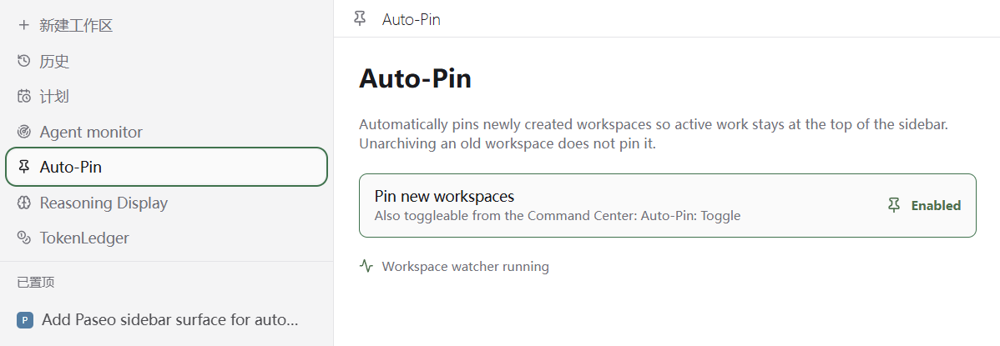

# paseo-auto-pin

A [Paseo](https://paseo.sh) plugin that automatically pins newly created
workspaces to the top of the sidebar.



## Features

- Pins workspaces through the daemon's `workspace.created` lifecycle hook,
  without requiring a client or the panel to be open.
- Existing workspaces and unarchive updates do not trigger auto-pin.
- Sidebar **Auto-Pin** panel and Command Center **Auto-Pin: Toggle** /
  **Auto-Pin: Open Panel** commands.
- Persistent switch in `$PASEO_HOME/plugin-data/auto-pin.json`, defaulting to
  `~/.paseo/plugin-data/auto-pin.json`. Enabled by default; existing settings
  survive the upgrade.
- Same-client toggles update the panel immediately; a 10-second poll reconciles
  changes from other clients. Concurrent server toggles are serialized.

## Installation

```bash
paseo plugin install https://github.com/stv1024/paseo-auto-pin
```

## Compatibility and migration

Version **0.2.0** targets **Paseo 0.8.x** and is tested against **0.8.0**.
Paseo 0.7 users should keep plugin version 0.1.0.

Paseo 0.8 requires a `requirements.paseo` manifest declaration, separate
`index.server.ts` / `index.client.tsx` entry points, and modules under
`server/`, `client/`, or `shared/`. The old single-entry plugin will not load.

The native lifecycle hook replaces workspace stream subscriptions, startup
snapshots, creation-time heuristics, and reads of Paseo's workspace database.
No startup RPC is needed to activate auto-pin. The `autopin.ensure` RPC name
is retained for status reads; it no longer starts a watcher.

The public `PaseoApi` still has no pin mutation in 0.8.0. Pinning therefore
uses `DaemonClient` from `@getpaseo/client/internal/daemon-client`, via a
short-lived connection to the local daemon's WebSocket endpoint. The internal
SDK dependency is pinned to 0.8.0; recheck this integration for future Paseo
releases. The adapter reads `daemon.listen` from the Paseo config and defaults
to `127.0.0.1:6767`, retaining the existing loopback connection behavior.

## Development

```bash
npm ci
npm run typecheck
npm test
paseo plugin install /path/to/paseo-auto-pin
paseo plugin reload auto-pin
paseo plugin logs auto-pin
```

`react` and `react-native` are supplied by the host at runtime.

| File | Role |
| --- | --- |
| `index.server.ts` | RPC and lifecycle registration |
| `index.client.tsx` | Sidebar surface and commands |
| `shared/contracts.ts` | RPC contracts |
| `server/lifecycle.ts` | Workspace-created hook and cleanup |
| `server/pin.ts` | Version-specific pin transport |
| `server/store.ts` | Persistent switch and serialized toggles |
| `client/panel.tsx` | Sidebar panel |
| `client/state.ts` | Shared state for panel and commands |
| `tests/` | Lifecycle and persistence regression tests |

## License

MIT
